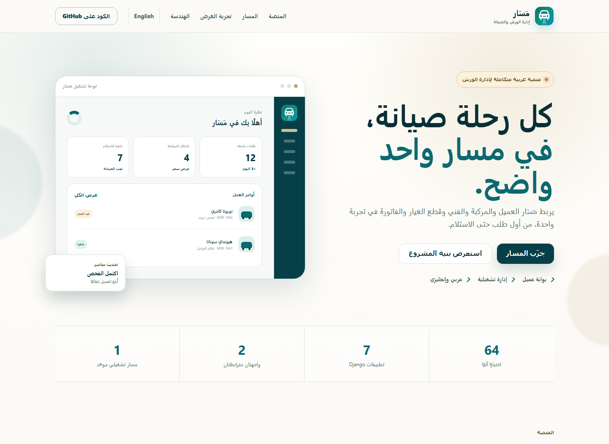
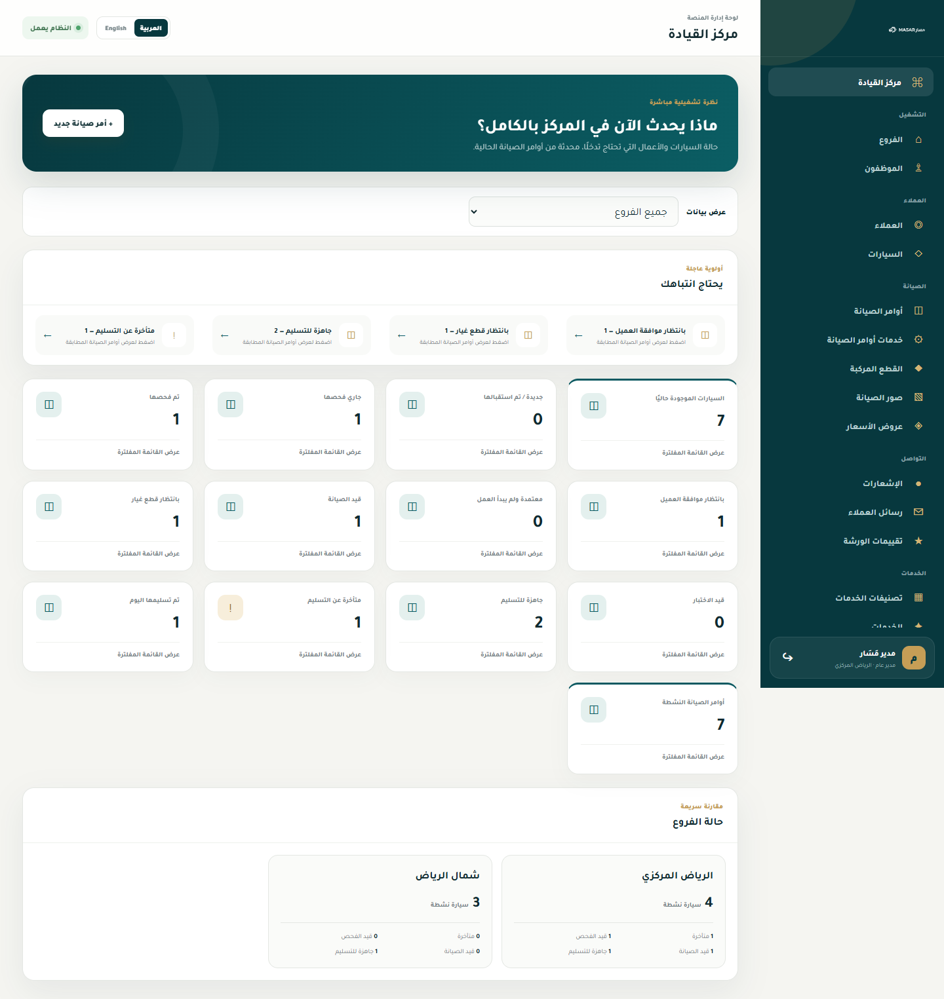

# مَسَار

[](https://github.com/talal-09/masar/actions/workflows/tests.yml)
[](LICENSE)

**لغة التوثيق: العربية · [English](README.md)**

**[استكشف عرض مَسَار التفاعلي بالعربية والإنجليزية](https://talal-09.github.io/masar/)**

<p align="center">
  
</p>

مَسَار منصة عربية متكاملة لإدارة ورش صيانة السيارات مبنية باستخدام Django. تربط رحلة العميل بالعمليات الداخلية اللازمة لإدارة المركبات والخدمات وقطع الغيار وأوامر العمل والفواتير والمدفوعات والفروع.

> هذا المستودع مشروع تعليمي ومعرض أعمال. بيانات التطوير المحلية اصطناعية وغير مخصصة للاستخدام الإنتاجي.

## معاينة المشروع

<p align="center">
  
</p>

> يستخدم العرض العام بيانات اصطناعية فقط، ولا يتصل بتطبيق Django أو يعرض سجلات تشغيلية.

### لوحة إدارة المركز

<p align="center">
  
</p>

> التُقطت الصورة من واجهة إدارة Django الفعلية باستخدام بيانات محلية اصطناعية. لا تظهر أي بيانات عملاء أو بيانات إنتاج حقيقية.

## المزايا

- تسجيل العملاء والمصادقة وإدارة الملفات الشخصية
- سعة مواعيد قابلة للضبط لكل فرع مع حماية من الحجز المتزامن
- تسجيل المركبات وعرض سجل الصيانة
- طلبات الصيانة وتتبع دورة حياة أمر العمل
- إدارة الفروع والموظفين والأدوار والصلاحيات
- دليل الخدمات والتصنيفات
- مخزون قطع الغيار وحركات المخزون
- عروض الأسعار والفواتير والخصومات والمدفوعات
- إشعارات العميل وتحديثات الحالة
- استعادة كلمة المرور برسائل لا تكشف وجود الحساب
- بوابة منفصلة للعميل ولوحة تشغيل للإدارة
- تقارير إدارية بفلترة زمنية وتصدير CSV
- سجل تدقيق لعمليات الإدارة والعملاء
- واجهة عربية وإنجليزية متجاوبة

## التقنيات

- **الخلفية:** Python وDjango
- **الواجهة:** Django Templates وHTML وCSS وJavaScript
- **قاعدة البيانات:** SQLite للتطوير المحلي وPostgreSQL للنشر
- **الوسائط:** تخزين محلي أو Cloudinary
- **النشر:** Gunicorn وWhiteNoise وإعداد متوافق مع Render
- **الاختبارات:** Django test framework وGitHub Actions

## بنية المشروع

| التطبيق | المسؤولية |
| --- | --- |
| `core` | الصفحات العامة والمصادقة والفروع والموظفون والوظائف المشتركة |
| `customers` | ملفات العملاء والمركبات والتحقق من الملكية |
| `maintenance` | أوامر العمل وعروض الأسعار والصور والإشعارات ومسار الحالة |
| `services` | تصنيفات الخدمات وخدمات الورشة |
| `inventory` | قطع الغيار وأرصدة الفروع وحركات المخزون |
| `billing` | الفواتير والبنود والخصومات والمدفوعات |
| `backoffice` | لوحة التشغيل والصلاحيات والإدارة اليومية |

## الأمان والموثوقية

- حماية Django من CSRF والتحقق من كلمات المرور
- أسرار وإعدادات إنتاج من متغيرات البيئة
- Secure Cookies وHTTPS وHSTS وحماية Clickjacking في الإنتاج
- صلاحيات حسب الدور وفحص ملكية العميل
- تقييد محاولات الدخول وتسجيل أحداث الأمان
- التحقق من أنواع الصور وحد أقصى 5 ميجابايت للرفع
- معاملات قاعدة بيانات للعمليات المالية وحركات المخزون متعددة الخطوات
- Pagination وتحسين استعلامات العلاقات
- 70 اختبارًا للمصادقة والصلاحيات والصيانة والمخزون والفوترة والأمان والتقارير
- CI يفحص migrations وإعدادات Django والاختبارات وإعدادات النشر

راجع [سياسة الأمان](SECURITY.md) لإرشادات الإبلاغ الخاص عن الثغرات.

## التشغيل المحلي

### المتطلبات

- Python 3.14
- Git

```powershell
git clone https://github.com/talal-09/masar.git
cd masar

python -m venv .venv
.\.venv\Scripts\Activate.ps1
pip install -r requirements.txt

Copy-Item .env.example .env
python manage.py migrate
python manage.py createsuperuser
python manage.py runserver
```

افتح `http://127.0.0.1:8000/`.

## الاختبارات

```powershell
python manage.py check
python manage.py test
```

التحقق المحلي الحالي: **70 اختبارًا ناجحًا**. يشغل GitHub Actions الفحوصات نفسها عند كل push وpull request إلى `main`.

## إعدادات النشر

انسخ `.env.example` إلى `.env` واستبدل القيم التجريبية قبل النشر. لا ترفع `.env` أو قاعدة البيانات أو ملفات المستخدمين أو بيانات الإنتاج إلى Git.

اضبط `DJANGO_DEBUG=False` واستخدم `DJANGO_SECRET_KEY` قويًا، ثم حدّد النطاقات المسموحة ومصادر CSRF الآمنة وقاعدة PostgreSQL.

استعادة كلمة المرور تعمل محليًا عبر Console Email Backend. للإنتاج، اضبط متغيرات `DJANGO_EMAIL_*` الخاصة بمزود SMTP؛ بدونها لن تُرسل الرسائل ولن تُطبع روابط الاستعادة في سجلات الإنتاج.

## المؤلف

بناه [Talal](https://github.com/talal-09) كمشروع عملي لتطوير تطبيقات Full-stack.

## الترخيص

مَسَار متاح وفق [ترخيص MIT](LICENSE).
