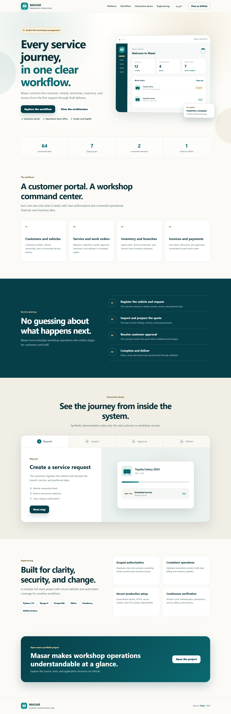
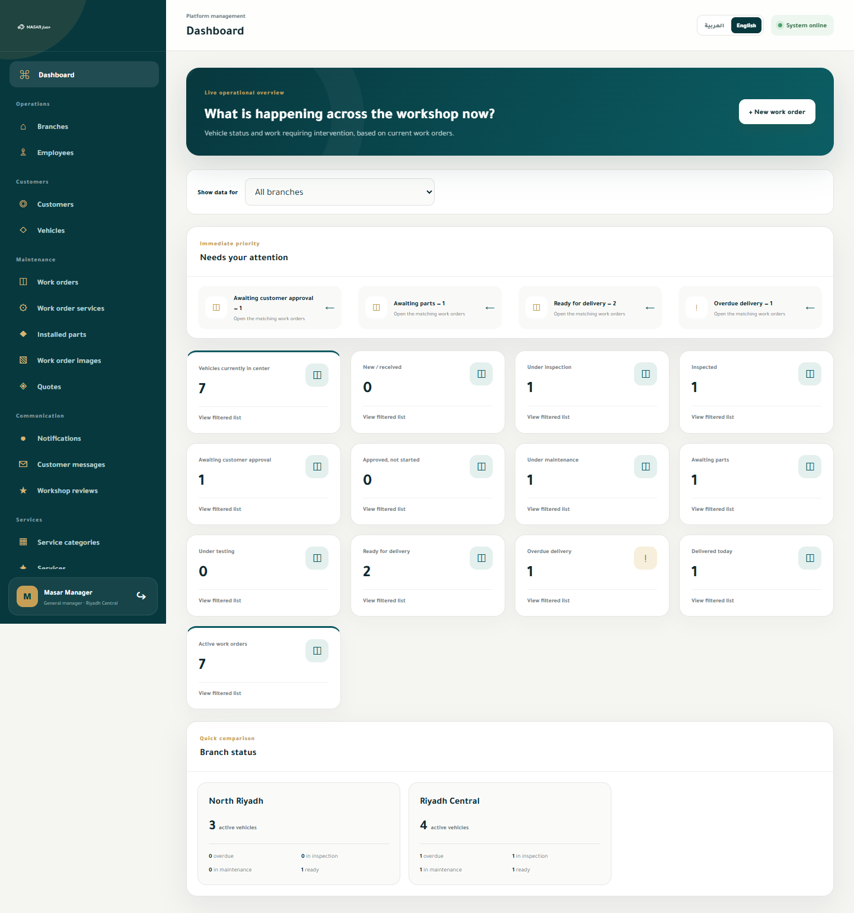

# Masar

[](https://github.com/talal-09/masar/actions/workflows/tests.yml)
[](LICENSE)

**Documentation language: English · [العربية](README.ar.md)**

**[Explore the live bilingual Masar showcase](https://talal-09.github.io/masar/)**

<p align="center">
  
</p>

Masar is an Arabic-first, full-stack workshop management platform built with Django. It connects customer-facing maintenance workflows with the operational tools needed to manage vehicles, services, spare parts, invoices, payments, and workshop branches.

> This repository is a portfolio and learning project. The local development data is synthetic and is not intended for production use.

## Project Preview

<p align="center">
  
</p>

> The public showcase uses synthetic demonstration data only. It does not connect to the Django application or expose operational records.

### Management Dashboard

<p align="center">
  
</p>

> Captured from the real Django management interface using synthetic local data. No customer or production records are shown.

## Features

- Customer registration, authentication, and profile management
- Configurable per-branch appointment capacity with concurrency-safe booking
- Vehicle registration and maintenance history
- Maintenance requests and work-order lifecycle tracking
- Workshop branches, employees, roles, and scoped permissions
- Service catalog and configurable workshop services
- Spare-parts inventory and stock movement tracking
- Quotes, invoices, discounts, and payment recording
- Customer notifications and status updates
- Password recovery with non-enumerating responses
- Separate customer portal and management back office
- Management reports with date filters and CSV export
- Audit trail for management and customer actions
- Arabic and English interface support
- Responsive templates and custom error pages

## Technology Stack

- **Backend:** Python, Django
- **Frontend:** Django Templates, HTML, CSS, JavaScript
- **Database:** SQLite for local development; PostgreSQL supported for deployment
- **Media storage:** Local storage or Cloudinary
- **Deployment:** Gunicorn, WhiteNoise, Render-compatible configuration
- **Testing:** Django test framework

## Project Structure

| App | Responsibility |
| --- | --- |
| `core` | Public pages, authentication, branches, employees, and shared functionality |
| `customers` | Customer profiles, vehicles, and ownership checks |
| `maintenance` | Work orders, quotes, images, notifications, and workflow state |
| `services` | Service categories and workshop services |
| `inventory` | Spare parts, branch stock, and stock movements |
| `billing` | Invoices, invoice items, discounts, and payments |
| `backoffice` | Management dashboard, permissions, and operational administration |

## Security and Reliability

- Django CSRF protection and password validation
- Environment-based secrets and production configuration
- Secure cookies, HTTPS redirection, HSTS, and clickjacking protection in production
- Role-based permissions and customer ownership checks
- Database-backed sign-in throttling and security-event auditing
- Validated image types and a 5 MB upload limit
- Database transactions for multi-step financial and inventory operations
- Pagination and optimized related-object queries
- Automated tests covering authentication, permissions, workflows, inventory, and billing
- Continuous integration checks for migrations, Django configuration, tests, and production deployment settings

See the [security policy](SECURITY.md) for private vulnerability reporting guidance.

## Local Setup

### Requirements

- Python 3.14
- Git

### Installation

```powershell
git clone https://github.com/talal-09/masar.git
cd masar

python -m venv .venv
.\.venv\Scripts\Activate.ps1
pip install -r requirements.txt

Copy-Item .env.example .env
python manage.py migrate
python manage.py createsuperuser
python manage.py runserver
```

Open `http://127.0.0.1:8000/` in your browser.

## Configuration

The project reads configuration from environment variables. Copy `.env.example` to `.env` for local development and replace all placeholder values before deployment.

| Variable | Purpose |
| --- | --- |
| `DJANGO_SECRET_KEY` | Django cryptographic signing key |
| `DJANGO_DEBUG` | Enables local debug mode; keep disabled in production |
| `DJANGO_ALLOWED_HOSTS` | Comma-separated allowed host names |
| `DJANGO_CSRF_TRUSTED_ORIGINS` | Comma-separated trusted HTTPS origins |
| `USE_TARGET_DATABASE` | Uses PostgreSQL when set to `1`; otherwise SQLite |
| `TARGET_DATABASE_URL` | PostgreSQL connection URL |
| `CLOUDINARY_CLOUD_NAME` | Optional Cloudinary cloud name |
| `CLOUDINARY_API_KEY` | Optional Cloudinary API key |
| `CLOUDINARY_API_SECRET` | Optional Cloudinary API secret |
| `DJANGO_EMAIL_BACKEND` | Password-reset email backend; production defaults to no delivery until configured |
| `DJANGO_EMAIL_HOST` | Optional SMTP host |
| `DJANGO_EMAIL_PORT` | Optional SMTP port; defaults to `587` |
| `DJANGO_EMAIL_HOST_USER` | Optional SMTP username |
| `DJANGO_EMAIL_HOST_PASSWORD` | Optional SMTP password |
| `DJANGO_EMAIL_USE_TLS` | Enables SMTP TLS |
| `DJANGO_DEFAULT_FROM_EMAIL` | Sender address for password-reset email |

Never commit `.env`, database files, uploaded media, or production credentials.

## Tests

Run the Django system checks and test suite:

```powershell
python manage.py check
python manage.py test
```

Current local verification: **70 tests passing**.

Every push and pull request to `main` runs the same checks through GitHub Actions.

## Deployment Notes

Masar includes a `Procfile` for Gunicorn and supports PostgreSQL, WhiteNoise static files, and Cloudinary media storage. Before deployment:

1. Set a strong `DJANGO_SECRET_KEY`.
2. Set `DJANGO_DEBUG=False`.
3. Configure allowed hosts and trusted HTTPS origins.
4. Set `USE_TARGET_DATABASE=1` and provide `TARGET_DATABASE_URL`.
5. Configure Cloudinary if persistent uploaded media is required.
6. Run migrations and collect static files.

## Author

Built by [Talal](https://github.com/talal-09) as a practical full-stack software development project.

## License

Masar is available under the [MIT License](LICENSE).
